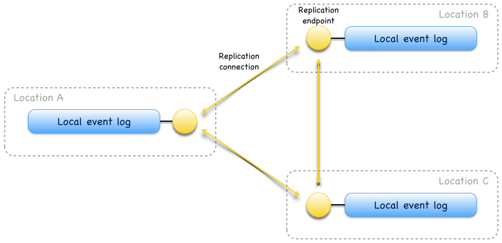
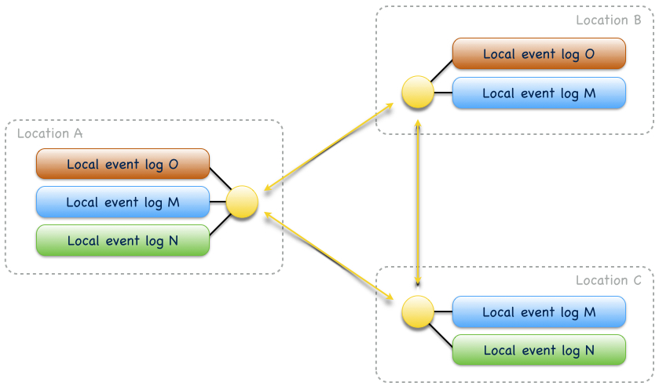
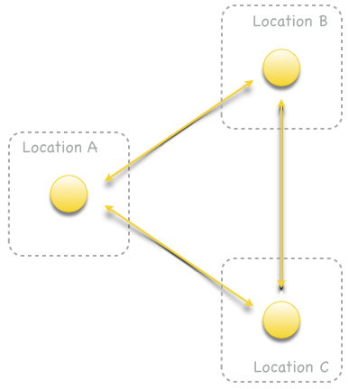
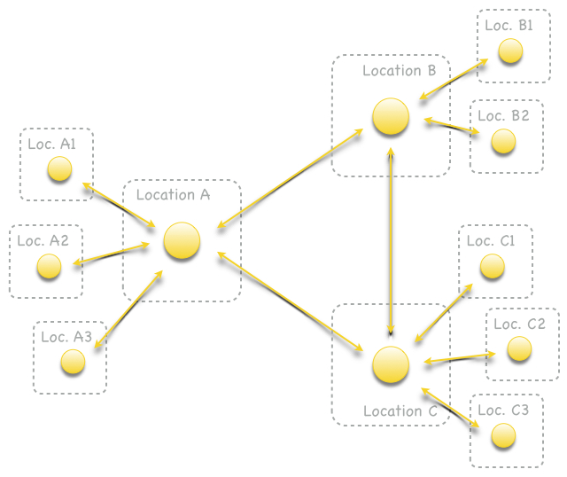
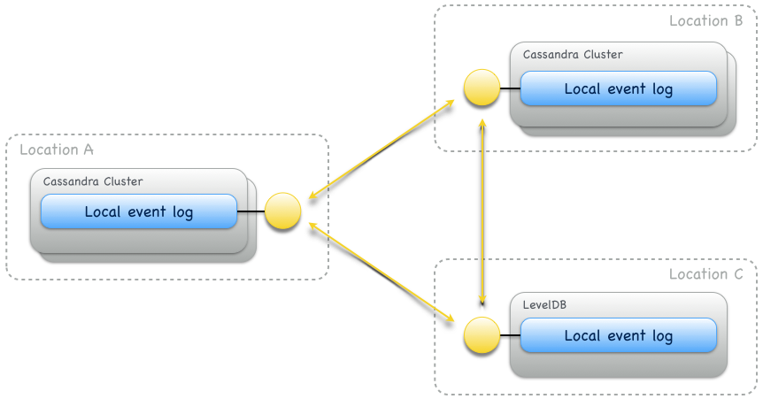
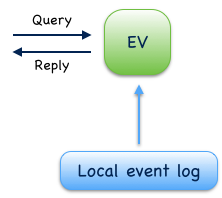
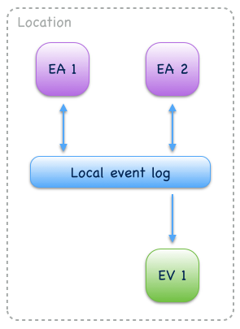
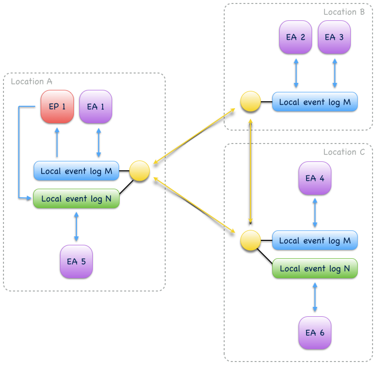
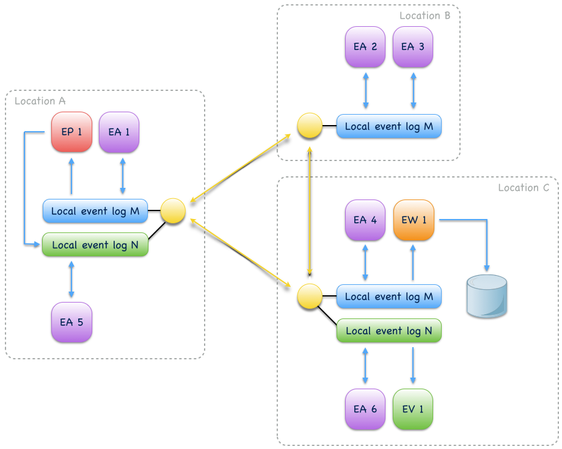

.. _architecture:

------------
Architecture
------------

The following sections describe architectural aspects of the features introduced in :ref:`overview`. Further details and API usage examples are given in the :ref:`user-guide` and the :ref:`reference`.

.. _event-logs:

Event logs
----------

The basic building block of an Eventuate event log is a :ref:`local-event-log`. It provides a total order over stored events and belongs to a *location*. A location is an availability zone and can have one or more local event logs. Events of a local event log can be asynchronously replicated to local event logs of other locations. For connecting local event logs from multiple locations to a :ref:`replicated-event-log`, local event logs must be made accessible via :ref:`replication-endpoints` and replication endpoints connected by *replication connections* (in one or both directions) to :ref:`arch-replication-networks`. A replicated event log is represented by one local event log at each participating location. 

.. _arch-fig1:

   Fig. 1

   A replicated event log, distributed across locations A, B and C.

Replication endpoints can manage one or more local event logs. Managed local event logs have a name and replication occurs only between logs of the same name. Logs with different names are isolated from each other\ [#]_ and their distribution across locations may also differ, as shown in :ref:`arch-fig2`:

.. _arch-fig2:

   Fig. 2

   Three replicated event logs. Log M (blue) is distributed across locations A, B and C. Log N (green) is distributed across locations A and C and log O (red) is distributed across locations A and B.

A replicated event log provides a causal order over stored events: the storage order at all locations is consistent with causal order i.e. consumers reading from a local event log will always see effects after their causes. Concurrent events, however, may have different storage order at different locations. Causality is tracked as *potential causality* with :ref:`vector-clocks`. Every event has an associated vector timestamp from which applications can determine whether any two events have a potential causal relationship or are concurrent.

.. note::
   Writes to a replicated event log are made by writing to any of its local event logs. Writes to a local event log are not coordinated with other locations. Without coordination, the strongest global ordering guarantee for a *replicated event log* is causal ordering. Relaxing the global ordering guarantee to causal ordering allows local event logs to remain available for writes during inter-location network partitions. When the partition heals, locally written events are reliably replicated to other locations.

.. _arch-replication-networks:

Replication networks
~~~~~~~~~~~~~~~~~~~~

Replication endpoints can be connected by replication connections to *replication networks*. Tolerance to replication endpoint failures depends on the density of the replication network. For example, :ref:`arch-fig3` shows a sparse replication network. A failure of location A partitions locations B and C. On the other hand, in a dense replication network as shown in :ref:`arch-fig4`, locations B and C can continue to replicate events if location A is not available.

.. _arch-fig3:

.. figure:: images/arch-03.png
   :figwidth: 40%

   Fig. 3

   A sparse replication network. Event logs are not shown.

.. _arch-fig4:

   Fig. 4

   A dense replication network. 

The read load on local event logs and network bandwidth usage increases with the density of the replication network. It is therefore recommended to reduce the replication network density with the number of participating locations. For larger replication networks, a common approach is to separate locations into *major locations* and *minor locations* where major locations form a dense replication network and minor locations form a hub-and-spoke network with their major location hub:

.. _arch-fig5:

   Fig. 5

   A dense replication network of major locations A, B and C with attached minor locations A1 - A3, B1 - B2 and C1 - C3, respectively. Minor locations form a hub-and-spoke network with their major location.

Replication filters
~~~~~~~~~~~~~~~~~~~

By default all events are replicated in a replicated event log. In many cases, however, a location only wants to replicate a subset of events to and from other locations. Restricting event replication to a subset of events can be done with *replication filters*. :ref:`replication-filters` can be defined per replication endpoint. They determine which events can be replicated **to** other locations. Replication filters can be used to make event collaboration, especially event-driven communication, more directed\ [#]_. Without replication filters all events are replicated to all locations in a replication network.

Storage backends
~~~~~~~~~~~~~~~~

Storage backends of local event logs are pluggable. Eventuate currently provides plugins for a :ref:`cassandra-storage-backend` and a :ref:`leveldb-storage-backend`. :ref:`custom-storage-backends` can be added by implementing a storage provider interface. For local event logs, storage providers must guarantee consistency among writers and readers in terms of strict event ordering.

This consistency requirement for storage backends limits their availability, hence, storage backends should not be shared across locations because locations represent availability zones. Instead, every location should operate its own storage backend instance(s). Synchronous event replication within a storage backend is optional and should be used to achieve stronger durability. Inter-location event replication is asynchronous and Eventuate-specific. It preserves causal event ordering and also works between locations with different storage backends:

.. _arch-fig6:

   Fig. 6

   A replicated event log, distributed across locations A, B and C. A Cassandra storage backend is used at locations A and B, a LevelDB storage backend at location C.

.. _event-sourcing:

Event sourcing
--------------

Eventuate provides several abstractions for building event-sourced application components. They all derive application state from events stored in :ref:`event-logs` but follow different strategies for managing derived state. A summary is given in :ref:`arch-tab1` and in the following subsections. Collaboration of event-sourced components is covered in section :ref:`arch-event-collaboration`.

.. _arch-tab1:
.. list-table:: Table 1: Event sourcing abstractions
   :widths: 20 70 10
   :header-rows: 1

   * - Abstraction
     - Description
     - Details
   * - :ref:`Event-sourced actor <event-sourced-actors>`
     - | Consumes events from its event log and 
       | produces new events to the same event log 
       | during command processing. Derived state 
       | is an in-memory write model, representing 
       | the command-side (C) of CQRS.
       |
       | An event-sourced actor may also produce 
       | new events during event processing which is
       | most relevant for :ref:`guide-event-driven-communication`
       | use cases.
     - - :ref:`User guide <guide-event-sourced-actors>`
       - :ref:`Reference <ref-event-sourced-actors>`
       - `API docs <latest/api/index.html#com.rbmhtechnology.eventuate.EventsourcedActor>`_
   * - :ref:`Event-sourced view<event-sourced-views>`
     - | Consumes events from its event log but 
       | cannot produce new events. Derived state 
       | is an in-memory read model, representing 
       | the query-side (Q) of CQRS.
     - - :ref:`User guide <guide-event-sourced-views>`
       - :ref:`Reference <ref-event-sourced-views>`
       - `API docs <latest/api/index.html#com.rbmhtechnology.eventuate.EventsourcedView>`_
   * - :ref:`Event-sourced writer<event-sourced-writers>`
     - | Consumes events from its event log and 
       | batch-updates an external query database 
       | using event data. Derived state is a persistent
       | read model, representing the query-side (Q) of
       | CQRS.
     - - :ref:`Reference <ref-event-sourced-writers>`
       - `API docs <latest/api/index.html#com.rbmhtechnology.eventuate.EventsourcedWriter>`_
   * - :ref:`Event-sourced processor<event-sourced-processors>`
     - | Consumes events from its event log and 
       | produces new events to a target event log 
       | during event processing. Processors can
       | connect event logs to event processing
       | pipelines or graphs.
     - - :ref:`Reference <ref-event-sourced-processors>`
       - `API docs <latest/api/index.html#com.rbmhtechnology.eventuate.EventsourcedProcessor>`_

.. _event-sourced-actors:

Event-sourced actors
~~~~~~~~~~~~~~~~~~~~

Event-sourced actors produce events to and consume events from an event log. During *command processing* they usually validate external commands against internal state and, if validation succeeds, write one or more events to their event log. During *event processing* they consume events they have written and update internal state by handling these events. This is the basic idea behind `event sourcing`_. When used in context of `CQRS`_, event-sourced actors usually implement the command-side (C).

.. _arch-fig7:

.. figure:: images/arch-07.png
   :figwidth: 40%

   Fig. 7

   An event-sourced actor, producing events to and consuming events from an event log.

When an event-sourced actor is re-started, internal state is recovered by replaying events from its local event log. Events are replayed in local storage order which is consistent with causal order. Event replay at a given location is deterministic i.e. doesn’t change when replay is repeated. Event replay can also be started from a snapshot of internal state which is an optimization to reduce recovery times.

Event-sourced actors can also interact with external services by sending commands and processing replies. Commands can be sent with *at-most-once* or *at-least-once* delivery semantics, depending on the reliability requirements of an application. Replies from external services are usually processed like external commands which may result in further events to be written. This way, external services can be included into reliable, event-driven business processes controlled by event-sourced actors (see also :ref:`reliable-delivery`).

.. _arch-fig8:

.. figure:: images/arch-08.png
   :figwidth: 60%

   Fig. 8

   External service integration.

.. _event-sourced-views:

Event-sourced views
~~~~~~~~~~~~~~~~~~~

Event-sourced views are a functional subset of event-sourced actors. They can only consume events from an event log but cannot produce new events. When used in context of `CQRS`_, views implement the query-side (Q). Applications use event-sourced views to update in-memory read models from consumed events. Applications that want to create persistent read models should use :ref:`event-sourced-writers` instead.

.. _arch-fig10:

   Fig. 10

   An event-sourced view, consuming events from an event log to update an in-memory read model.

.. _event-sourced-writers:

Event-sourced writers
~~~~~~~~~~~~~~~~~~~~~

Event-sourced writers are a specialization of event-sourced views. They also consume events from an event log but update a persistent read model in an external query database. This can be a relational database, a graph database, a simple key value store or whatever is needed by an application. Read model updates are made in incremental batches which are prepared during event processing. For query processing, applications access the external query database directly.

.. _arch-fig11:

.. figure:: images/arch-11.png
   :figwidth: 60%

   Fig. 11

   An event-sourced writer, consuming events from an event log to update a persistent read model in an external query database.

.. _event-sourced-processors:

Event-sourced processors
~~~~~~~~~~~~~~~~~~~~~~~~

An event-sourced processor consumes events from one event log, processes them and produces the processed events to another event log. Event-sourced processors are idempotent producers and a specialization of event-sourced writers. Applications use processors to connect event logs to event stream processing pipelines and graphs. Fore more complex event stream processing use cases, Eventuate provides :ref:`overview-stream-processing-adapters` to 3rd-party stream processing frameworks.

.. _arch-fig12:

.. figure:: images/arch-12.png
   :figwidth: 60%

   Fig. 12

   An event-sourced processor, consuming events from one event log and producing processed events to another an event log.

.. _arch-event-collaboration:

Event collaboration
-------------------

Events produced by one event-sourced component can be consumed by other event-sourced components if they share an event log. This allows them to communicate via events a.k.a. :ref:`overview-event-collaboration`. Collaborators subscribe to their event log (see :ref:`overview-event-bus`) so that newly written events can be pushed to subscribers. This allows them to react on events with minimal latency. Event collaboration over a local event log is called *local event collaboration* (:ref:`arch-fig13`):

.. _arch-fig13:

   Fig. 13

   Local event collaboration of event-sourced actors EA 1 and EA 2 and event-sourced view EV 1. Events produced by one event-sourced actor can be consumed by the other event-sourced actor and the event-sourced view.

Event collaboration over a replicated event log across locations is called *remote event collaboration* (:ref:`arch-fig14`). Remote event collaboration is reliable and partition-tolerant. A collaborator can continue to write events to its location even if it is partitioned from other locations. Remote collaborators automatically receive the written event when the partition heals.

.. _arch-fig14:

.. figure:: images/arch-14.png
   :figwidth: 90%

   Fig. 14

   Remote event collaboration of event-sourced actors EA 1 and EA 2 and event-sourced view EV 1. Events produced by one event-sourced actor can be consumed by the other event-sourced actor and the event-sourced view even if they are distributed across locations.

An event-sourced component that subscribes to an event log first replays stored events to recover internal state (optionally, starting from a state snapshot) and then continues to consume *live events* to update internal state and produce new events (optional). At a given location, event-sourced components are guaranteed to see live events in the same order as replayed events during later recoveries.

.. _arch-event-driven-communication:

Event-driven communication
~~~~~~~~~~~~~~~~~~~~~~~~~~

Event-driven communication is a collaboration of event-sourced components of different type (:ref:`arch-fig15`), usually to execute a distributed business process. On receiving events, collaborators usually update state and produce new events\ [#]_.

.. _arch-fig15:

   Fig. 15

   Event-driven communication between event-sourced actors EA 1 - EA 4 over event log M and event-sourced actors EA 5 and EA 6 over event log N. Event-sourced processor EP 1 consumes events from event log M and produces processed events to event log N so that event-sourced actors EA 5 and EA 6 can additionally react on these events.

Event-driven communication follows a publish-subscribe pattern which can be made more directed with custom :ref:`event-routing` rules, :ref:`replication-filters` and/or connecting different event logs with event-sourced processors.

.. hint::
   The user guide shows a very simple example of reliable :ref:`guide-event-driven-communication` with two event-sourced actors playing ping-pong.

.. _arch-actor-state-replication:

Actor state replication
~~~~~~~~~~~~~~~~~~~~~~~

Actor state replication is a collaboration of event-sourced actors of same type (:ref:`arch-fig16`). They consume each other’s events to reconstruct actor state locally with causal consistency. Actor state can be updated at multiple locations concurrently. Conflicting updates can either be resolved automatically or interactively.

.. _arch-fig16:

.. figure:: images/arch-16.png
   :figwidth: 90%

   Fig. 16

   Two replicated event-sourced actors, EA 1 and EA 2. EA 1 is replicated across locations A, B and C, EA 2 across locations A and B. Replicas can be updated at multiple locations concurrently.

.. hint::
   Simple actor state replication and conflict resolution examples are shown in the :ref:`user-guide`. The :ref:`example-application` offers a command-line interface to experiment with state replication and interactive conflict resolution. :ref:`operation-based-crdts` are an application of actor state replication with automated conflict resolution.

.. _arch-event-aggregation:

Event aggregation 
~~~~~~~~~~~~~~~~~

Event aggregation is an uni-directional collaboration of event-sourced views or writers with event-sourced actors. They aggregate events from one or more event-sourced actors on the same event log to create application-specific views. Event aggregation from several different event logs can be achieved by connecting them with event-sourced processors.

.. _arch-fig17:

   Fig. 17

   Same event collaboration scenario as in :ref:`arch-fig15` with two additional event consumers: an event-sourced writer EW 1 on event log M and an event-sourced view EV 1 on event log N. EW 1 consumes i.e. aggregates events from event-sourced actors EA 1 - EA 4 to update a persistent read model. EV 1 aggregates events from event-sourced actors EA 5 and EA 6 plus processed events from event log M to update an in-memory read model.  

.. hint::
   The :ref:`guide-event-sourced-views` section of the user guide and the :ref:`ref-event-sourced-writers` section of the reference show implementation examples of event-sourced views and writers, respectively. 

.. _operation-based-crdts:

Operation-based CRDTs
---------------------

An application of :ref:`arch-actor-state-replication` are Eventuate’s operation-based CRDTs. These are replicated data types that automatically converge under concurrent updates, provided that update operations are delivered and applied in causal order. Exactly this can be achieved by storing update operations as events in a replicated event log which allows replicas to consume and apply them in causal order. 

Eventuate manages CRDT replicas in CRDT actors, specialized event-sourced actors that are contained in *CRDT services* (:ref:`arch-fig18`). CRDT services provide asynchronous methods for reading and updating managed CRDTs. CRDT state can be automatically recovered from operations stored in the event log, optionally starting from a snapshot.

.. _arch-fig18:

.. figure:: images/arch-18.png
   :figwidth: 100%

   Fig. 18

   A replicated OR-Set service, distributed across locations A, B, and C. OR-Set replicas are managed by CRDT actors that are contained in OR-Set service instances.

Eventuate currently provides services for the following operation-based CRDTs: *Counter*, *MV-Register*, *LWW-Register*, *OR-Set* and *OR-Cart* (a shopping cart CRDT). All of them are specified in `A comprehensive study of Convergent and Commutative Replicated Data Types`_ and were implemented with Eventuate’s CRDT development framework. This framework can be used to implement further operation-based CRDTs and their corresponding services.

.. hint::
   More details are covered in the :ref:`commutative-replicated-data-types` section of the user guide and in `this article`_.

.. _this article: http://krasserm.github.io/2016/10/19/operation-based-crdt-framework/

.. _vector-clocks:

Vector clocks
-------------

Eventuates uses `vector clocks`_ on event log level to track *happened-before* relationships (= potential causality) of events. Event-sourced actors that share a local event log also share an entry in a vector clock whereas actors from different locations contribute to different entries in a vector clock. This is formalized in `plausible clocks`_ and further described in `ticket 68`_. Log level vector clocks are a reasonable choice as all actors that share a local event log also receive events in the same order. The size of a log level vector clock scales with the number of locations. 

.. _batching:

Batching
--------

Eventuate internally uses batching to optimize read and write throughput. It is used for

- producing new events to the event log: Whenever a write operation to an event log is in progress, new write requests are batched and served when the previous write operation completed. This strategy leads to dynamically increasing write-batch sizes (up to a configurable maximum) under increasing write loads. If there is no current write operation in progress, a new write request is served immediately, keeping latency at a minimum.
- consuming events from the event log: Events can be read from the event log in batches which allows for fast event replay and efficient integration of external consumers.
- replicating events: Events are replicated in batches of configurable size. They are batch-read from a source log, batch-transferred over a replication connection and batch-written to a target log.
- writing to external databases: :ref:`event-sourced-writers` update persistent read models in incremental batches. When a write to an external query database is in progress, new event processing results are batched in-memory and written with the next scheduled write.

.. [#] Eventuate applications often use multiple event logs for organizing events into topics, grouping event-sourced collaborators or scaling writes, for example. Event logs can be connected by :ref:`event-sourced-processors` to event processing pipelines or graphs, if needed.
.. [#] Another mechanism for restricting event collaboration to a subset of collaborators is ``aggregateId``-based :ref:`event-routing`
.. [#] Event-sourced actors can not only produce new events during command processing but also during event processing as shown in the :ref:`guide-event-driven-communication` section of the user guide.

.. _CQRS: http://martinfowler.com/bliki/CQRS.html
.. _CRDT: http://en.wikipedia.org/wiki/Conflict-free_replicated_data_type

.. _vector clocks: http://en.wikipedia.org/wiki/Vector_clock
.. _plausible clocks: http://link.springer.com/article/10.1007%2Fs004460050065
.. _event sourcing: http://martinfowler.com/eaaDev/EventSourcing.html
.. _aggregate: http://martinfowler.com/bliki/DDD_Aggregate.html

.. _ticket 68: https://github.com/RBMHTechnology/eventuate/issues/68
.. _ticket 103: https://github.com/RBMHTechnology/eventuate/issues/103
.. _let us know: https://gitter.im/RBMHTechnology/eventuate

.. _A comprehensive study of Convergent and Commutative Replicated Data Types: http://hal.upmc.fr/file/index/docid/555588/filename/techreport.pdf