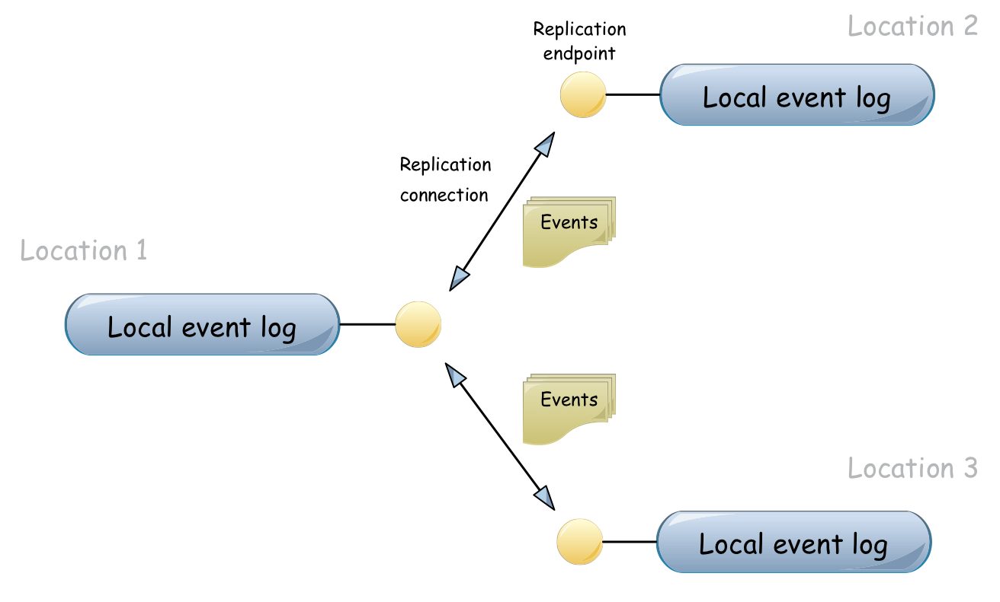
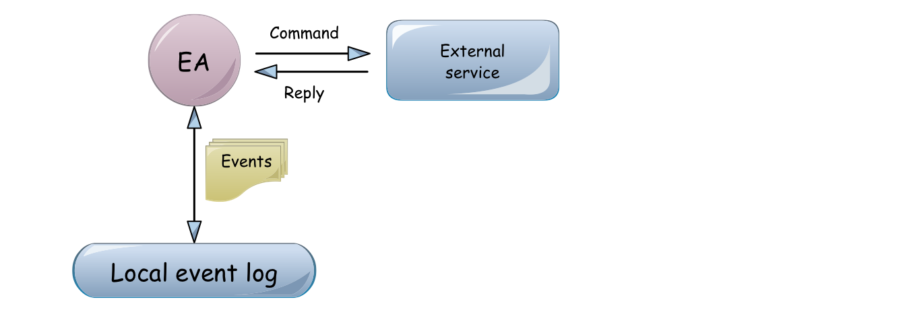

.. _architecture:

------------
Architecture
------------

The following sections give an overview of the main functional building blocks of Eventuate. Further details are given in the :ref:`user-guide` and in the :ref:`reference`.

.. _event-logs:

Event logs
----------

Eventuate applications store events in one or more event logs. An event log can be replicated across *locations* where each location has its own copy of events in a *local event log*. Events are asynchronously replicated via *replication connections* between *replication endpoints*.

.. _arch-fig1:

   Fig. 1

   An event log, replicated across locations 1, 2 and 3 via an acyclic replication network.

Writes to a local event log are not coordinated with other locations. Without coordination, the strongest global ordering guarantee for a *replicated event log* is causal ordering which is tracked with :ref:`vector-clocks`. Events in a local event log have a total order that is location-specific but consistent with causal order at all locations. Relaxing the global ordering guarantee to causal ordering allows local event logs to remain available for writes during inter-location network partitions.

:ref:`arch-fig1` shows a replicated event log with an acyclic replication network. Should location 1 become unavailable, locations 2 and 3 are partitioned and cannot continue to exchange events. To prevent that situation, a replicated event log may also have a cyclic replication network as shown in :ref:`arch-fig2`.

.. _arch-fig2:

.. figure:: images/architecture-1a.png
   :figwidth: 70%

   Fig. 2

   An event log, replicated across locations 1, 2 and 3 via a cyclic replication network.

A replication endpoint can also manage more than one local event log. Local event logs can be given a name and replication occurs only between logs of the same name. Logs with different names are isolated from each other\ [#]_. Also, their distribution across locations may differ, as shown in the following figure.

.. figure:: images/architecture-2.png
   :figwidth: 70%

   Fig. 3

   Three replicated event logs. Log X (blue) is replicated across locations 1, 2 and 3. Log Y (red) is replicated across locations 1 and 2 and log Z (green) is replicated across locations 1 and 3.

Event storage backends at individual locations are pluggable. A location that requires stronger durability guarantees should use a storage backend that synchronously replicates events within that location (like the :ref:`cassandra-storage-backend`), others may want to use a more lightweight, non-replicated storage backend in case of weaker durability requirements (like the :ref:`leveldb-storage-backend`). Applications can also integrate :ref:`custom-storage-backends` into Eventuate by implementing a storage provider interface.

Event replication across locations is reliable. Should there be a network partition or a location crash, replication automatically resumes when the partition heals or the crashed location recovers. Built-in failure detectors inform applications about (un)availability of peer locations.

Replication connections can also be configured with replication filters, so that only events matching one or more filter criteria are replicated. This is especially useful for smaller locations (for example, mobile devices) that only need to exchange a subset of events with other locations.

Event sourcing
--------------

Eventuate provides several abstractions for building event-sourced application components. They all derive application state from events stored in :ref:`event-logs` but follow different strategies for managing derived state. A summary is given in :ref:`arch-tab1`, more information in the following subsections. For further details, follow the links in the *Details* column.

.. _arch-tab1:
.. list-table:: Table 1: Event sourcing abstractions
   :widths: 20 70 10
   :header-rows: 1

   * - Abstraction
     - Description
     - Details
   * - :ref:`Event-sourced actor <event-sourced-actors>`
     - | Consumes events from its event log and 
       | emits new events to the same event log 
       | during command processing. Derived state 
       | is an in-memory write model, representing 
       | the command-side (C) of CQRS.
     - - :ref:`User guide <guide-event-sourced-actors>`
       - :ref:`Reference <ref-event-sourced-actors>`
       - `API docs <latest/api/index.html#com.rbmhtechnology.eventuate.EventsourcedActor>`_
   * - :ref:`Event-sourced view<event-sourced-views>`
     - | Consumes events from its event log but 
       | cannot emit new events. Derived state 
       | is an in-memory read model, representing 
       | the query-side (Q) of CQRS.
     - - :ref:`User guide <guide-event-sourced-views>`
       - :ref:`Reference <ref-event-sourced-views>`
       - `API docs <latest/api/index.html#com.rbmhtechnology.eventuate.EventsourcedView>`_
   * - :ref:`Event-sourced writer<event-sourced-writers>`
     - | Consumes events from its event log and 
       | batch-updates an external query database 
       | using event data. Derived state is a persistent
       | read model, representing the query-side (Q) of
       | CQRS.
     - - :ref:`Reference <ref-event-sourced-writers>`
       - `API docs <latest/api/index.html#com.rbmhtechnology.eventuate.EventsourcedWriter>`_
   * - :ref:`Event-sourced processor<event-sourced-processors>`
     - | Consumes events from its event log and 
       | emits new events to a target event log 
       | during event processing. Processors can
       | connect event logs to event processing
       | pipelines or graphs.
     - - :ref:`Reference <ref-event-sourced-processors>`
       - `API docs <latest/api/index.html#com.rbmhtechnology.eventuate.EventsourcedProcessor>`_

.. _event-sourced-actors:

Event-sourced actors
~~~~~~~~~~~~~~~~~~~~

Event-sourced actors produce events to and consume events from an event log. During *command processing* they usually validate external commands against internal state and, if validation succeeds, write one or more events to their event log. During *event processing* they consume events they have written and update internal state by handling these events. This is the basic idea behind `event sourcing`_. When used in context of a `CQRS`_ architecture, event-sourced actors usually implement the command-side (C).

.. figure:: images/architecture-3.png
   :figwidth: 70%

   Fig. 4

   An event-sourced actor, producing events to and consuming events from an event log.

When an event-sourced actor is re-started, internal state is recovered by replaying events from its local event log. Events are replayed in local storage order which is consistent with causal order. Consequently, event replay at a given location is deterministic i.e. doesn’t change when replay is repeated. Event replay can also be started from a snapshot of internal state which is an optimization to reduce recovery times.

In addition to consuming their own events, event-sourced actors can also consume events produced by other event-sourced actors to the same event log. This enables `event collaboration`_ between actors (:ref:`arch-fig5`). Applications can customize :ref:`event-routing` between actors.

A special form of event collaboration is state replication where actors of the same type consume the same events at different locations to re-construct state. Another example is a distributed business process where actors of different type collaborate by exchanging events to achieve a common goal.

.. _arch-fig5:

.. figure:: images/architecture-4.png
   :figwidth: 70%

   Fig. 5 

   Two event-sourced actors exchanging events over a replicated event log.

Event-sourced actors may also interact with external services by sending commands and processing replies. Commands can be sent with *at-most-once* or *at-least-once* delivery semantics, depending on the reliability requirements of an application. Replies from external services are usually processed like external commands which may result in further events to be written. This way, external services can be included into reliable, event-driven business processes controlled by event-sourced actors.

   Fig. 6

   External service integration.

.. _event-sourced-views:

Event-sourced views
~~~~~~~~~~~~~~~~~~~

.. role:: strike
   :class: wy-text-strike

Event-sourced views are a functional subset of event-sourced actors. They can only consume events from an event log but cannot produce new events. When used in context of a `CQRS`_ architecture, views implement the query-side (Q).

Applications use event-sourced views to create in-memory read models from consumed events. Applications that want to create persistent read models should use :ref:`event-sourced-writers` instead.

.. _event-sourced-writers:

Event-sourced writers
~~~~~~~~~~~~~~~~~~~~~

Event-sourced writers are a specialization of event-sourced views. They also consume events from an event log but persist the created read model to an external, application-specific query database (which can be a relational database, a graph database or a simple key value store, for example). Event-sourced writers update the query database in incremental batches. For query processing, applications use the external query database directly.

.. _event-sourced-processors:

Event-sourced processors
~~~~~~~~~~~~~~~~~~~~~~~~

An event-sourced processor consumes events from one event log, processes them (stateless or stateful) and produces the processed events to another event log. Event-sourced processors are idempotent producers and a specialization of event-sourced writers. Applications use processors to connect event logs to event stream processing pipelines and graphs. Connectivity to other stream processing solutions is given by :ref:`adapters`.

.. _operation-based-crdts:

Operation-based CRDTs
---------------------

Eventuate provides implementations of :ref:`commutative-replicated-data-types` (commutative replicated data types or CmRDTs) that rely on a replicated event log to reliably broadcast update operations to replicas. CmRDTs are managed by *CRDT services* that provide applications convenient access to their instances. New CmRDT types can developed with Eventuate’s CRDT development framework.

.. _vector-clocks:

Vector clocks
-------------

Eventuates uses `vector clocks`_ to track *happened-before* relationships (= potential causality) of events and provides means to limit the size of these clocks. 

By default, event-sourced actors that share an event log at a given location also share an entry in a vector clock. Event-sourced actors from different locations contribute to different entries in a vector clock. Consequently, concurrency of events can only be reliably detected if they have been emitted at different locations. This is formalized in `plausible clocks`_ and further described in `ticket 68`_. The main advantage of this approach are clock sizes that scale with the usually small number of locations in the worst case, still covering many use cases.

Although plausible clocks are a reasonable default for many Eventuate applications, others need more fine-grained tracking of potential causality. To achieve that goal, event-sourced actors can opt-in to have their own entry in a vector clock instead of sharing it with others. This is especially useful for applications that additionally need to detect concurrent events within a location which is further described in `ticket 103`_.

A consequence of more-fine grained causality tracking can be larger vector clocks. On the other hand, only events that are actually handled by an event-sourced actor contribute to that actor’s vector clock. Therefore, selective event handling in combination with :ref:`event-routing` rules (as applied in a one-\ aggregate_-per-actor design, for example) can additionally help to keep vector clock sizes small.

.. _batching:

Batching
--------

Eventuate internally uses batching to optimize read and write throughput. It is used for

- producing new events to the event log: Whenever a write operation to an event log is in progress, new write requests are batched and served when the previous write operation completed. This strategy leads to dynamically increasing write-batch sizes (up to a configurable maximum) under increasing write loads. If there is no current write operation in progress, a new write request is served immediately, keeping latency at a minimum.

- consuming events from the event log: Events can be read from the event log in batches which allows for efficient integration of external consumers.

- replicating events: Events are replicated in batches of configurable size. They are batch-read from a source log, batch-transferred over a replication connection and batch-written to a target log.

- writing to external databases: :ref:`event-sourced-writers` update persistent read models in incremental batches. When a write to an external query database is in progress, new event processing results are batched in-memory and written with the next scheduled write.

.. _adapters:

Adapters
--------

Eventuate aims to integrate with stream processing solutions such as Spark Streaming, Storm or Samza. The ability to exchange events with these solutions enables support for many analytics use cases. We plan to provide adapters for

- `Spark Streaming`_
- Samza_
- Storm_
- akka-streams_
- scalaz-stream_

We haven’t started yet working on this. Should you have any preferences or proposals for further integrations, please `let us know`_. Of course, we love contributions :)

.. _CQRS: http://martinfowler.com/bliki/CQRS.html
.. _CRDT: http://en.wikipedia.org/wiki/Conflict-free_replicated_data_type

.. _akka-streams: http://doc.akka.io/docs/akka-stream-and-http-experimental/current/scala.html
.. _scalaz-stream: https://github.com/scalaz/scalaz-stream
.. _Spark Streaming: https://spark.apache.org/streaming/
.. _Samza: http://samza.apache.org/
.. _Storm: https://storm.apache.org/
.. _Apache Kafka: https://kafka.apache.org/

.. _vector clocks: http://en.wikipedia.org/wiki/Vector_clock
.. _plausible clocks: http://link.springer.com/article/10.1007%2Fs004460050065
.. _event sourcing: http://martinfowler.com/eaaDev/EventSourcing.html
.. _event collaboration: http://martinfowler.com/eaaDev/EventCollaboration.html
.. _aggregate: http://martinfowler.com/bliki/DDD_Aggregate.html

.. _ticket 68: https://github.com/RBMHTechnology/eventuate/issues/68
.. _ticket 103: https://github.com/RBMHTechnology/eventuate/issues/103
.. _let us know: https://groups.google.com/forum/#!forum/eventuate

.. [#] :ref:`event-sourced-processors` can be used to connect otherwise partitioned event logs.  
